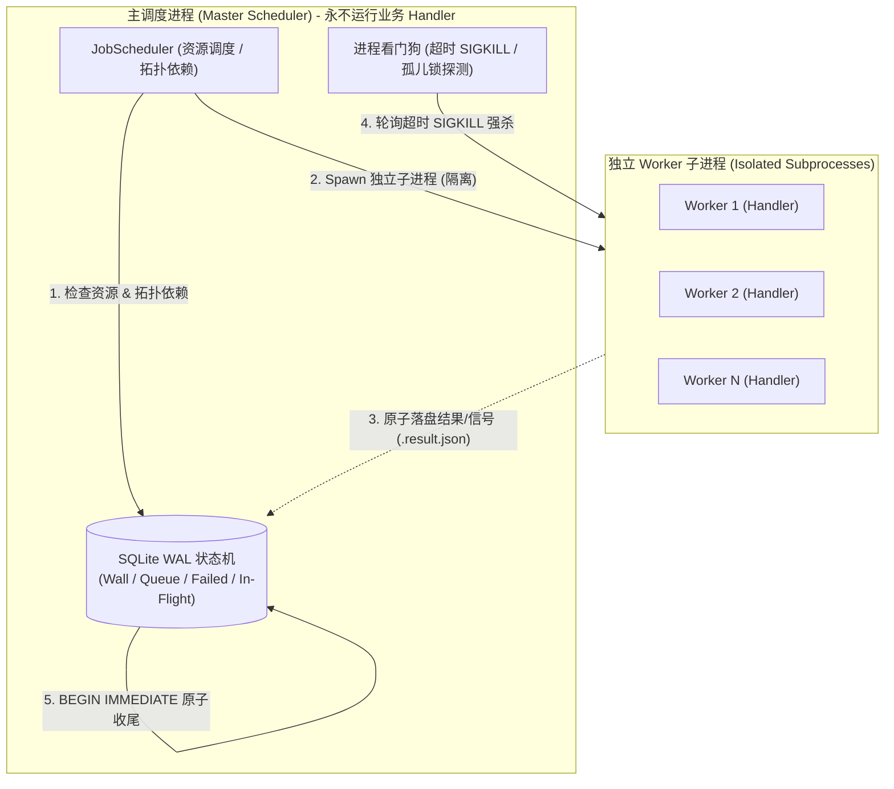

# ⚡ TaskLite — 零依赖、进程隔离的轻量任务编排引擎

> **A Lightweight Task Orchestration Engine for Agent & Batch Pipelines.**  
> 专为 **AI Agent 批量处理**、数据同步与采集、音视频转码、离线 ETL 与后台批处理任务打造。  
> 核心解决「单线程处理耗时长」、「中途失败需全量重跑」、「子任务卡死拖垮主流程」等工程痛点。采用类似 **systemd** 的守护与物理进程隔离架构，内置 SQLite WAL 事务持久化，子进程崩溃或断电不坏库，重启自动断点续跑。

[](https://www.python.org/)
[](LICENSE)
[]()
[-orange.svg)]()
[]()

---

## 💡 为什么选择 TaskLite？

在运行大量并发任务（如 AI Agent 批量调用、大模型推理批处理、多媒体文件处理、离线数据流转）时，常见方案常面临以下痛点：

- **单脚本串行或简单循环**：
  - ❌ 单线程处理速度慢、耗时长；
  - ❌ 跑上千个任务时，第 800 个报错导致整个程序终止，缺乏断点记录，下次必须**全量重跑**。
- **标准库进程池 (`multiprocessing.Pool` / `ProcessPoolExecutor`)**：
  - ❌ 缺乏内置状态持久化，程序中断后已完成进度丢失；
  - ❌ 子任务发生 C 扩展段错误 (SIGSEGV) 或内存泄露 (OOM) 时，容易导致主进程一同崩溃；
  - ❌ 缺少全局速率限制与服务熔断机制，缺乏 DAG 拓扑依赖与死信隔离。
- **重型分布式任务队列 (`Celery` / `Airflow` / `Temporal`)**：
  - ❌ 强依赖 Redis、RabbitMQ、PostgreSQL 等外部服务，本地单机运行或轻量嵌入脚本时运维成本过高；
  - ❌ 架构较重，不适合作为随用随走的轻量批处理脚手架。

**TaskLite 的设计定位**：  
**零依赖的单机批处理脚手架**——只需 `pip install tasklite-engine`。
1. **多 Worker 并发加速**：多进程并行执行，充分利用多核算力，彻底解决单线程耗时长的问题；
2. **断点续跑防重跑**：以 SQLite WAL 事务表记录状态，已完成的任务自动跳过，失败任务进入死信队列或退避重试，杜绝因个别失败导致全量重跑；
3. **物理隔离与容灾**：主进程只负责调度，业务逻辑在独立子进程中运行并设超时强杀，即使子任务崩溃、死锁或系统断电，状态依然完整可恢复。

---

## 📊 方案对比矩阵

| 特性维度 | TaskLite | ProcessPoolExecutor | Celery | Airflow / Prefect |
| :--- | :---: | :---: | :---: | :---: |
| **外部依赖** | **零依赖 (标准库+SQLite)** | 零依赖 | 需 Redis / RabbitMQ | 需 DB + Web Server |
| **物理进程隔离** | **独立 spawn 子进程 + SIGKILL** | 进程池复用（易污染） | Worker 进程池 | 依赖 Runner 调度 |
| **子进程异常隔离** | **主进程不崩溃，支持自动重试** | 进程退出 | Worker 重启（易丢任务） | 需外部重启 |
| **状态持久化** | **SQLite WAL ACID 事务** | 无持久化 | 依赖 Broker 配置 | 数据库记录 |
| **抗漂移增量探索 (Discovery)** | **内置函数式无游标去重** | 无 | 无 | 需自定义传感器 |
| **全局限速与持久化休眠** | **内置令牌桶 + 跨重启持久化** | 无 | 需 Redis 限流组件 | 需复杂调度配置 |
| **DAG 依赖与级联熔断** | **内置拓扑依赖 + 自动跳过** | 无 | 需 Canvas 复杂编排 | 原生支持 |
| **产物沙盒与失败自动清理** | **内置 declare_output** | 无 | 无 | 需自定义 Hook |

---

## 🏗️ 核心架构与设计哲学



### 三层崩溃恢复防线
1. **执行代标识 (Generation Tag)**：结果文件携带 `{uid}.{run_id}.{seq}`，前次崩溃的孤儿进程结果对新 Run 不可见；
2. **启动期残留消费**：启动时自动识别并提交崩溃前已落盘的有效结果，不重复执行；
3. **孤儿文件锁探测 (Lockfile Fencing)**：严格保证同一 UID 在全局只有一个物理执行体。

---

## 🌟 核心特性

### 1. 🛡️ 进程隔离与守护 (Process Isolation)
- 主进程作为总控调度器，不执行具体的业务代码；
- 每一个任务均在独立的 `spawn` 子进程中隔离执行；
- 当子进程发生死循环或超时，看门狗将在指定超时后发送 `SIGKILL` 强杀子进程并自动回收资源；
- 子进程发生异常退出或被操作系统终止时，不影响主调度进程的稳定运行。

### 2. ⚡ SQLite WAL 状态持久化 (ACID)
- 基于 SQLite WAL + `synchronous=FULL` 模式；
- 四集合状态机（Wall 已完成 / Queue 待办 / In-Flight 在途 / Failed 死信）在单次事务中原子转移；
- 遭遇中断或异常关机时，重启后支持 At-Least-Once 接续执行。

### 3. 🔍 函数式增量探索 (Functional Discovery)
- 针对数据同步、采集与拉取场景的无游标 (Cursor-less) 增量扫描；
- 直接复用已完成集合 (Wall) 即时判定已见内容，整页命中自动刹车，天然免疫上游记录删除、插入导致的游标漂移。

### 4. ⏸️ 全局限流与配额熔断持久化休眠
- 内置 `RateLimitResource`（速率限制）与 `CapacityResource`（并发限制）；
- 遇到 HTTP 429 速率限制或配额超限时，调用 `ctx.suspend_resource("api", 3600)` 挂起全管线，休眠状态跨进程、跨重启持久化。

### 5. 🔗 DAG 拓扑依赖与级联熔断
- 任务通过 `depends_on` 声明依赖；
- 父任务失败进入死信队列时，所有下游依赖自动标记跳过 (`JOB_DEPENDENCY`)，避免无效计算。

### 6. 📦 产物沙盒与自动清理
- `ctx.declare_output()` 声明产出文件，内置路径遍历防御 (`../` 拒绝)；
- 任务成功时校验物理产出完整性，任务失败时自动清理半成品文件，避免残留。

### 7. 🌐 组合式 HTTP 网络工具与快照守卫 (HTTP Wrappers)
- 开放 Callable 设计，支持原生 `urllib`、`requests`、`httpx` 或平台自定义签名 SDK；
- `http_guard` 自动捕获 429、解析 `Retry-After` 并触发 `ctx.suspend_resource` 全管线退避，收敛异常三分类；
- `SQLiteSnapshotStore` 提供单射键原始响应快照持久化，支持全离线幂等重放；
- 内置标准 Netscape `cookies.txt` 解析工具。

---


## 🚀 快速上手 (Quickstart)

### 安装

要求 **Python ≥ 3.9**，零外部依赖：
 
```bash
pip install tasklite-engine
```

### 最小示例

```python
import logging
from tasklite import TaskLite, Job, RetryError, RateLimitResource

logging.getLogger("tasklite").setLevel(logging.INFO)

# 1. 定义任务处理器（在独立子进程中执行）
def download_handler(job: Job, ctx):
    # 声明产出文件（失败时自动清理半残文件）
    out = ctx.declare_output(f"./downloads/{job.job_id}.jpg", cleanup_on_fail=True)
    
    # 模拟业务下载
    success = do_download(job.payload["url"], out)
    if not success:
        raise RetryError("网络抖动，触发指数退避重试")
    
    return True, {"size": 1024, "path": str(out)}

# 2. 初始化引擎与配置资源
pipeline = TaskLite(
    name="media_downloader",
    state_dir="./state",        # 状态持久化目录（SQLite WAL）
    output_root="./downloads",  # 产物沙盒根目录
    max_workers=4,              # 并发子进程数
)

# 3. 注册全局限速（每秒最多 2 次请求）与处理器
pipeline.add_resource(RateLimitResource("api", interval_seconds=0.5))
pipeline.register_handler("download", download_handler, default_resources={"api": 1.0})

# 4. 入队并启动（阻塞直到队列全部完成）
pipeline.enqueue([
    Job("download", "img_001", payload={"url": "https://example.com/1.jpg"}),
    Job("download", "img_002", payload={"url": "https://example.com/2.jpg"}),
])
pipeline.run()
```

---

## 🍳 实战 Recipes

### Recipe 1: 增量分页扫描器 (Discovery)

无需游标，增量同步时只要发现整页内容已全部处理过，自动刹车停止扫描：

```python
from tasklite.wrappers.discovery import register_discovery

def fetch_page(job, ctx, page: int):
    # 从第 1 页开始逐页获取列表，返回空列表表示翻页结束
    return api.get_author_posts(author_id=job.payload["author_id"], page=page)

def item_id(post) -> str:
    return str(post["id"])  # 唯一内容 ID

def process_item(job, ctx, post, content_id: str):
    # 发现新内容时派生子任务（content_id 已做单射净化）
    ctx.spawn(Job("download", content_id, payload={"url": post["url"]}))

# 注册增量探索
register_discovery(
    pipeline,
    task_type="discover_author",
    fetch_func=fetch_page,
    id_func=item_id,
    process_item_func=process_item,
    process_task_type="download",
    default_resources={"api": 1.0},
)
```

### Recipe 2: 视频转码与 DAG 依赖级联

下载完成后自动触发转码，下载若失败则自动跳过转码：

```python
# 构造具有拓扑依赖的任务链
download_job = Job("download", "video_101", payload={"url": "https://example.com/v.mp4"})
transcode_job = Job(
    "transcode",
    "video_101",
    payload={"preset": "1080p"},
    depends_on=[download_job.uid],  # 依赖 download::video_101
)

pipeline.enqueue([download_job, transcode_job])
pipeline.run()
```

### Recipe 3: 遭遇 429 限流与配额熔断全局休眠

```python
from tasklite import RateLimitHit

def fetch_handler(job, ctx):
    resp = requests.get(job.payload["url"])
    if resp.status_code == 429:
        # 全管线挂起 api 资源 1 小时，状态持久化到磁盘，随后抛出退避重试
        ctx.suspend_resource("api", seconds=3600)
        raise RateLimitHit("Triggered 429, suspending API for 1h")
    return True, resp.json()
```

### Recipe 4: AI Agent / 大模型批量任务断点续跑

批量调用大模型处理数千条文本，多进程并发加速 + 速率控制 + 自动断点续跑：

```python
import json
from pathlib import Path
from tasklite import TaskLite, Job, RateLimitResource

def agent_worker(job: Job, ctx):
    # 模拟 Agent 分析并生成结果
    prompt = job.payload["prompt"]
    result = call_llm(prompt)
    
    # declare_output 返回解析后的绝对路径字符串（str），用 Path 包装后写文件，
    # 保证写入位置与框架校验/清理位置一致
    out_path = Path(ctx.declare_output(f"./results/{job.job_id}.json", cleanup_on_fail=True))
    out_path.write_text(json.dumps(result, ensure_ascii=False))
    return True, {"tokens": result.get("usage", 0)}

pipeline = TaskLite(name="agent_batch", state_dir="./agent_state", max_workers=8)
pipeline.add_resource(RateLimitResource("llm_rpm", interval_seconds=0.1))
pipeline.register_handler("analyze", agent_worker, default_resources={"llm_rpm": 1.0})

# 入队海量任务，中途即使断网或意外中断，重启后自动跳过已完成任务接续执行
pipeline.enqueue([
    Job("analyze", f"doc_{i}", payload={"prompt": f"分析文本 {i}"})
    for i in range(1000)
])
pipeline.run()
```

### Recipe 5: 官方 HTTP 守卫与原始响应快照重放 (HTTP Wrappers)

```python
from tasklite import TaskLite, RateLimitResource
from tasklite.wrappers.http import SQLiteSnapshotStore, http_guard, fetch_urllib

pipeline = TaskLite("crawler", state_dir="./states")
pipeline.add_resource(RateLimitResource("api", interval_seconds=1.0))

# 原始 HTTP 响应持久化快照（独立 snapshots.db，支持全离线重放与反爬保护）
snapshot_store = SQLiteSnapshotStore("./snapshots.db")
cached_fetch = snapshot_store.cached(fetch_urllib)

def crawler_handler(job, ctx):
    # 429 时自动挂起 api 资源、5xx 瞬态重试、4xx 直接 DLQ
    with http_guard(ctx=ctx, resource="api", default_suspend_ttl=60.0):
        resp = cached_fetch(job.payload["url"])
        return resp.json()

pipeline.register_handler("fetch", crawler_handler, default_resources={"api": 1.0})
```

---


## 🛠️ 死信队列与运维 (DLQ & Ops)

当任务重试超限或发生致命错误时，任务进入持久化死信队列 (DLQ)。可以通过标准 API 检查与清理：

```python
# 1. 检查死信详情
for entry in pipeline.list_dlq():
    print(f"UID: {entry.uid}, 错误类型: {entry.error_type}, 原因: {entry.error}")

# 2. 清理指定类型的 DLQ（默认保留 fatal 错误，可入队同名任务重跑）
pipeline.clear_dlq(task_types=["download"], keep_fatal=False)

# 3. 精确或前缀清理历史（wall / failed）
pipeline.clear_history("download::")
```

---

## 📁 目录结构

```
tasklite/
├── pipeline.py          # TaskLite 核心门面与配置
├── hooks.py             # 用户工具函数（job_ref / progress_hook / slice_list）
├── engine/              # 核心执行机器群
│   ├── runtime.py       # 核心运行期深模块、主循环事件泵 (EngineRuntime)
│   ├── config.py        # RunConfig 静态装配快照、默认值唯一解析点
│   ├── session.py       # RunSession 单次 run 生命周期状态与钩子单一出口
│   ├── pacing.py        # 事件泵等待/空闲决策纯函数（decide_wait）
│   ├── types.py         # 引擎公共值对象单一真相源
│   ├── store.py         # 状态事务、3-strike 崩溃与死锁归因 (StateStore)
│   ├── console.py       # OpsConsole：run() 外纯运维接缝（管理 API 委托目标）
│   ├── dispatch.py      # 任务派发状态机 (DispatchMachine)
│   ├── completion.py    # 任务完成与提交 (CompletionMachine)
│   ├── recovery.py      # 崩溃检测与恢复 (RecoveryMachine)
│   ├── channel.py       # IPC 与子进程执行通道 (ExecutionChannel / WorkerLaunchSpec)
│   ├── scheduler.py     # 资源调度与 DAG 依赖 (JobScheduler)
│   └── resource.py      # 令牌桶限速与并发容量资源
├── backend/             # SQLite WAL 强一致事务持久化后端
├── models/              # Job / TaskContext / PipelineState 数据模型
├── taxonomy.py          # 错误分类法与校验分类深模块 (ErrorTaxonomy)
├── wrappers/            # discovery.py（增量扫描）/ http.py（网络守卫与快照）
└── utils/               # jsonutil (禁NaN) / lockfile
```

---

## 📄 开源许可证

本项目基于 [MIT License](LICENSE) 开源。
